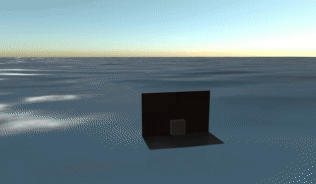

# bevy_water

Dynamic water material (with waves) for [Bevy](https://bevyengine.org/).

# Example

```
cargo run --release --example ocean
```


# Features

- Moving 3d waves (vertex height offset).
- Tileable - allows for adding/removing tiles of water for endless ocean.
- Normals calculated based on wave height for lighting.
- Imports `bevy_pbr::*` shader for lighting/shadow support.

# Ideas/Improvements

- [ ] Improve water color/texture.
- [ ] Heightmap support to adjust waves based on water depth.
- [ ] Mask texture to remove water from areas that shouldn't have water.
- [ ] Volumetic water below the surface.
- [ ] Dynamic depth buffer for objects partially below the surface (boats, peers).  Render pass?

# Versions

- Bevy 0.8: `bevy_water = "0.8"`
