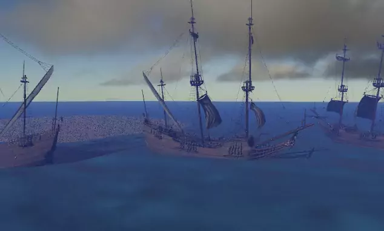

# bevy_water

Dynamic water material (with waves) for [Bevy](https://bevyengine.org/).

# Example

A fleet of pirate ships moving with the waves.

```
cargo run --release --example ocean
```


[Pirate ship from asset pack CC0](https://www.kenney.nl/assets/pirate-kit)

## WASM examples

### Setup

```sh
rustup target add wasm32-unknown-unknown
cargo install wasm-bindgen-cli
```

### Build & Run

Following is an example for `ocean`. For other examples, change the `ocean` in the
following commands.

```sh
cargo build --release --example ocean --target wasm32-unknown-unknown \
	--no-default-features --features embed_shaders

wasm-bindgen --out-name wasm_example \
  --out-dir examples/wasm/target \
  --target web target/wasm32-unknown-unknown/release/examples/ocean.wasm
```

Then serve `examples/wasm` directory to browser. i.e.

```sh
# cargo install basic-http-server
basic-http-server examples/wasm
```

# Features

- Moving 3d waves (vertex height offset).
- Get the wave height using `get_wave_point` to dynamically move objects based on the water height.
- Tileable - allows for adding/removing tiles of water for endless ocean.
- Normals calculated based on wave height for lighting.
- Imports `bevy_pbr::*` shader for lighting/shadow support.

# Ideas/Improvements

- [ ] Improve water color/texture.
- [ ] Heightmap support to adjust waves based on water depth.
- [ ] Mask texture to remove water from areas that shouldn't have water.
- [ ] Volumetic water below the surface.
- [ ] Dynamic depth buffer for objects partially below the surface (boats, peers).  Render pass?

# Versions

- Bevy 0.10: `bevy_water = "0.10"`
- Bevy 0.9: `bevy_water = "0.9"`
- Bevy 0.8: `bevy_water = "0.8"`
